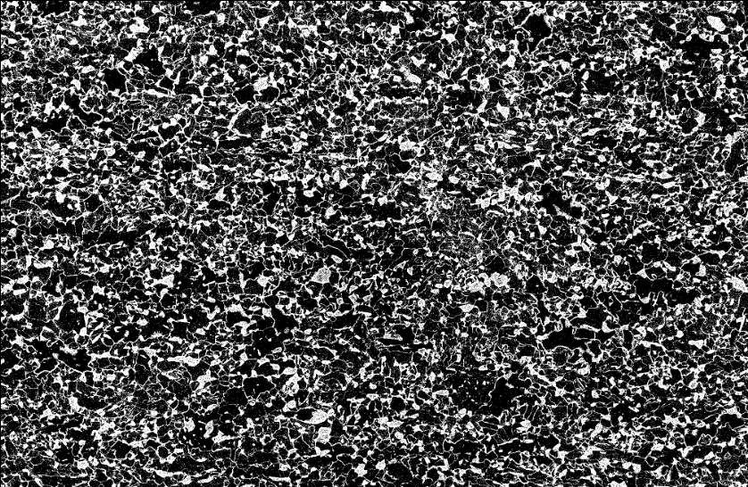
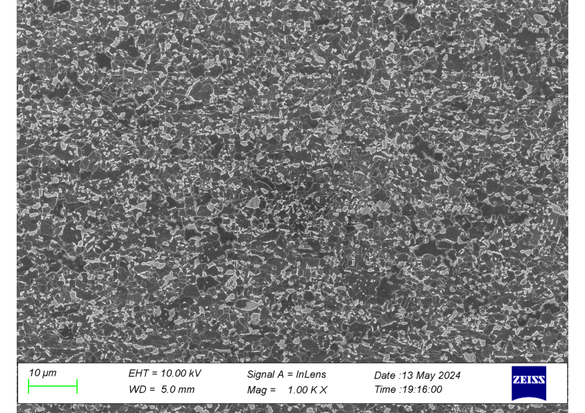
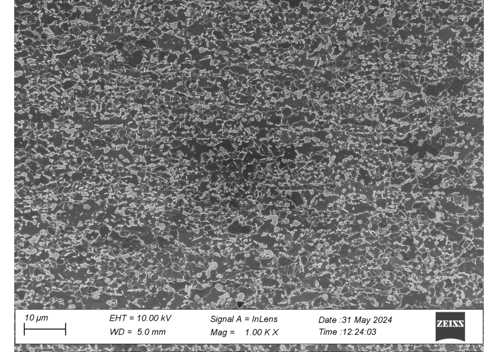
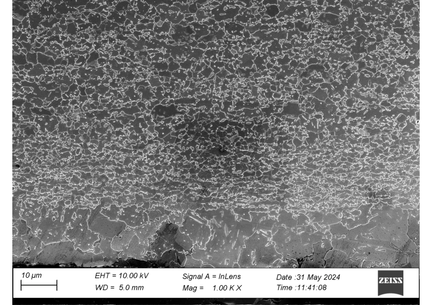

**데이터 재료과학**

국립창원대학교 재료금속공학과 [정영웅](mailto:yjeong@changwon.ac.kr)

# 수업 목표
 - 최신 데이터 기반의 재료공학 이해를 위한 기초 Python & JuPyter 활용 능력 기초
 - 기초 Python 이해를 바탕으로, 재료공학적 문제 해결에 응용
# 주차별 내용

# Week1 (개요, 설치, 변수 및 연산자) -
## 수업 01-1
 - 목표
   + 수업 개요 및 진행, 규칙 설명
 - Orientation
   + 수업 개론
   + 수업 내용 소개
   + 수업 진행 방식
 - 개념 설명
 - 실습
   + 반드시 스스로 실습하기 원칙
   + 물에 몸을 담그지 않고 수영을 배울 수 없다.
   + 스스로 실습하지 않고서는 배울 수 없음.
     * 반드시 개인용 컴퓨터 필요 - 실습
     * 없다면 학교에서 대여
   + 친구/가족에게 빌리거나, 구매 필요함.
   + 그외 기타 사정으로 수업을 듣고 싶으나 노트북 준비가 어렵다면
          교수에게 상담 요청하시오.
 - 평가 방법
   + 출석과 결석
   + 중간/기말 평가
 - 과제
   * 파이썬 설치 및 환경 설정 완성 (Python 3.12, JuPyter, VS code, pip)
## 수업 01-2
 - 오늘 목표
   * 파이썬 설치 및 환경 설정 완성 (Python 3.12, JuPyter, VS code, pip)
   * VS code에서 JuPyter 셋업 & 구동할 수 있다.
   * Hello, world
   * 실습 예시를 모두 이해하고 풀 수 있다.
   * 'Traceback'이해하고 대처할 수 있다.
 - 수업 내용
   * Jupyter notebook 간단한 키조작 가능
   * 셀(cell) 만들기, 지우기, 입력, 이동(navigation)
      + 코드 셀
      + Markdown 셀
   * 주석(comment)과 명령문(statement) 구분하기
   * 변수 선언과 자료형 (```int```, ```float```, ```str```, ```bool```) 이해하기
   * 연산자 이해하기
      + 산술 연산자 (더하기, 빼기, 곱하기, 나누기, 지수, 나머지, 몫 ... )
      + 비교 연산자 (==, !=, <, >, >=, <=, is, is not, in, not in)
      + 논리 연산자 (and or)
        ```python
        # 1. 값 비교
        print(5 == 5)       # True (값이 같음)
        print(5 != 3)       # True (값이 다름)
        print(7 > 2)        # True (7이 2보다 큼)
        print(3 < 7)        # True (3이 7보다 작음)
        print(5 >= 5)       # True (5가 5보다 크거나 같음)
        print(4 <= 6)       # True (4가 6보다 작거나 같음)

        # 2. 객체 동일성 비교
        a = [1, 2, 3]
        b = [1, 2, 3]
        c = a

        print(a == b)       # True  (값이 같음)
        print(a is b)       # False (메모리 주소 다름)
        print(a is c)       # True  (같은 객체)
        print(a is not b)   # True  (다른 객체)

        # 3. 포함 여부
        text = "Fe2O3"
        print("F" in text)      # True  ('a'가 문자열에 포함됨)
        print("O" not in text)  # True  ('z'가 문자열에 없음)

        numbers = [1, 2, 3]
        print(2 in numbers)     # True  (리스트에 2가 포함됨)
        print(5 not in numbers) # True  (리스트에 5가 없음)
       ```
 - 실습 예시
   * pip 활용하여 NumPy 설치하고, package directory 찾기.
   * 인치(inch_leng) 길이를 센치미터(cmeter_leng)로 바꿔서 계산. 센치 미터를 인치로
     계산해보기.
     + 25 cm는 몇 inch인가?
     + 170 cm는 몇 inch인가?
     + 15 inch에다가 50 cm를 더하면 총 길이가 얼마인가?
   * 섭씨(cent_deg)를 화씨(fahr_deg)로, 그리고 화씨(fahr_deg)를 섭씨(cent_deg)로 계산해보기.
        ```python
        ## 예시
        c = float(input("섭씨 온도: "))
        f = c * 9/5 + 32
        print(f"{c:.2f}C= {f:.2f}F")
        ```
     + 섭씨 25도는 화씨로 몇도인가?
     + 화씨 35도는 섭씨 몇도인가?
     + 화씨 20도에 섭씨 -5도를 더하면 화씨와 섭씨로 각각 몇도인가?
   * 한쪽이 30 cm 다른 한변이 40 inch라면 총 면적은 어떻게 되나?
   * 세륨의 평균 원자량 계산 (Fundamentals of Materials Science and Engineering, Calister 예제 2.1)
     ```python
     #세륨의 동위원소는 4가지 존재한다:
     # 각 동위원소의 분율은 아래와 같다.
     Ce136_f =  0.185  #[%]
     Ce138_f =  0.251  #[%]
     Ce140_f = 88.450  #[%]
     Ce142_f = 11.114  #[%]
     # 각 동위원소의 원자량은 아래와 같다.
     Ce136_w = 135.907 #[amu.]
     Ce138_w = 137.906 #[amu.]
     Ce140_w = 139.905 #[amu.]
     Ce142_w = 141.909 #[amu.]

     # 세륨의 평균 원자량은 얼마인가?
     ```
     가상의 원소 M의 평균 원자량 구하는 방법
     $$
     \bar{A}_M=\sum_if_{i_M}A_{i_M}
     $$

     단순 평균이라면...
     $$\frac{w^{^{136}Ce}+w^{^{138}Ce}+w^{^{140}Ce}+w^{^{142}Ce}}{4}$$
     로 구했겠지만, 서로 다른량이 존재하므로 주어진 분율을 활용해야겠다. 즉
     $$\frac{w^{^{136}Ce}f^{^{136}Ce}+w^{^{138}Ce}f^{^{138}Ce}+w^{^{140}Ce}f^{^{140}Ce}+w^{^{142}Ce}f^{^{142}Ce}}{f^{^{136}Ce}+f^{^{138}Ce}+f^{^{140}Ce}+f^{^{142}Ce}}$$
# Week2 (자료구조, 제어, 반복)
 - 목표
   + List, Tuple, Dictionary, set
   + 조건문과 (conditions), 반복문 (loop) 이해
## 수업 02-1
  - list, tuple, dictionary 생성/수정/조회
    +  List
      * 특징:
        + 수정 가능(mutable): 추가, 삭제, 변경 가능
        + 중복 허용
        + 순서 있음 (ordered)
        + 여러 자료형 혼합해서 저장 가능
      * 리스트 생성 - 대괄호 사용 ```[]```
        ```python
        elements = ["H", "He", "Li", "Be"]
        ```
      * 요소 접근 (인덱싱; indexing); 0에서 부터 시작
        ```python
        print(elements[0])   # H
        ```
      * 요소 변경
        ```python
        elements[1] = "Helium"
        print(elements)     #elements = ["H", "Helium", "Li", "Be"]
        ```
      * 요소 추가 / 삭제
        ```python
        elements.append("B")   #elements = ["H", "Helium", "Li", "Be", "B"]
        elements.remove("Li")  #elements = ["H", "Helium", "Be", "B"]
        ```
      * 중복 허용
        ```python
        elements = ['H','He','H']
        print(elements)
         ```
      * 여러 자료형 혼합
        ```python
        myList=['H',203,2.3,['H','He']]
        myMatrix=[[1,2,3],[4,5,6],[7,8,9]] ##중첩된 리스트
        ```
      * 언패킹 (unpacking)
        ```python
        a,b,c,d=[1,3,4,5]
        ```
    + tuple
      * 특징
        + 수정 불가능 (immutable); 한번 만들어지면 이후 변경 불가능
        + 중복 허용
         + 순서 있음
         + 여러 자료형 혼합해서 저장 가능
      * 튜플 생성 - 소괄호 ```()``` 사용
        ```python
         colors = ("red", "green", "blue")
         # 요소 접근
         print(colors[1])   # green

         # 변경 불가 → 아래 코드는 오류 발생
         # colors[1] = "yellow"

         # 튜플 언패킹
         r, g, b = colors
         print(r, g, b)     # red green blue
         ```
    + set
      * 특징
        + 중복제거: 같은 값이 입력되어도 하나만 남게 됨
        + 순서없음
        + 인덱싱 불가: list나 tuple과 다름
        + 수정 가능 (mutable)
        + 원소의 타입에 제한 **있음**:
      * 실습
        + 실습1: 생성
          ```python
          # 중괄호 {} 사용
          s1 = {1, 2, 3}
          print(s1)  # {1, 2, 3}

          # set() 함수 사용
          s2 = set([1, 2, 2, 3])
          print(s2)  # {1, 2, 3} (중복 제거)

          # 빈 set 생성 시는 set()만 가능
          empty_set = set()
          print(empty_set)  # set()
          ```
        + 실습2: 변경
          ```python
          s = {1, 2, 3}

          # 추가
          s.add(4)           # {1, 2, 3, 4}
          s.update([5, 6])   # {1, 2, 3, 4, 5, 6} (여러 개 추가)

          # 삭제
          s.remove(3)        # {1, 2, 4, 5, 6} (없는 값 제거 시 오류 발생)
          s.discard(10)      # 없는 값 제거해도 오류 없음
          s.pop()            # 임의의 값 제거 후 반환 (순서 없으니 랜덤)
          ```

    +  Misc.
      * ```len``` built-in function중 하나
        ```python
        a=[3,4,5,'a','b']
        len(a) # 정수 5
        ```
      * List slicing
        ```python
        a=[0,1,2,3,4,5]
        # format
        # a[begin:end:step]; end-begin = len(a)
        a[::] # == a[0:6:1] ## default
        a[1::2] # == a[1:6:2]
        ```
      * 실습
        - 1족 원소 기호를 순서대로 포함한 리스트 만들기 (수소, 리튬, 나트륨, 칼륨, 루비듐, 세슘, 프랑슘)
        - Calister 예제 2.1)
        ```python
        #세륨의 동위원소는 4가지 존재한다:
        # 각 동위원소의 분율은 아래와 같다.
        Ce_f= [0.185, 0.251, 88.450, 11.114]  #[%]
        # 각 동위원소의 원자량은 아래와 같다.
        Ce_w = [135.907, 137.906, 139.905, 141.909]
        # 세륨의 평균 원자량은 얼마인가?
        avg=(Ce_f[0]*Ce_w[0]+ Ce_f[1]*Ce_w+[1]+ Ce_f[2]*Ce_w+[2]+ Ce_f[3]*Ce_w+[3])/(Ce_f[0]+Ce_f[1]+Ce_f[2]+Ce_f[3])
        ## average
        print(avg)
        ```

## 수업 02-2
 - ```if```, ```elif```, ```else``` 조건문 이해
    * 기본 구조
    ```python
    if 조건식:
        실행할 명령문1
        실행할 명령문2
        ...
    elif 다른조건식:
        실행할 명령문1
        실행할 명령문2
        ...
    else:
        실행할 명령문1
        실행할 명령문2
        ...
    ```
    * 주의
      + indent, dedent 에 주의!!
      + 콜론 기호 ':' 빼먹지 말 것!
    * 예시
      + 예1
        ```python
        # 예: 순수 알루미늄의 녹는점
        melting_point = 660  #Celcius degree
        temperature = 700    #Celcius degree

        if temperature < melting_point:
            print("Solid state")
        elif temperature == melting_point:
            print("Solid and liquid co-exist")
        else:
            print("Liquid state")
        ```

 - ```for``` 반복문
    * 기초 설명
      파이썬의 for 반복문은 **순서가 있는 데이터(시퀀스)**나 **반복 가능한 객체(iterable)**를 순차적으로 꺼내면서 코드를 실행하는 구문.
    * 기본 구조
       ```python
       for 변수 in 반복가능객체:
            실행할 명령문1
            실행할 명령문2
            ...
       ```
    * 대표적으로 **순서가 있는 데이터 시쿼스**로는 List, Tuple, Dictionary 타입의 변수가 있다.
      + 예1
       ```python
       a=[3,4,5] #list type
       for e in a:
           print(e)
       ```
      + 예2
       ```python
       a=('3',[34343],5) # tuple type
       for e in a:
           print(e)
       ```
      + 예3
       ```python
       a=dict(a='b',b='1',d=3,z=[]) # dictionary (Python 3.7>)
       for e in a:
           print(e)
       ```
    * 주의
      + indent, dedent 에 주의!!
      + 콜론 기호 ':' 빼먹지 말 것!

 - Built-in function인 ```range```, ```len```를 ```for```와 함께 조합!
    * 개념
      + ```len()``` -> 시퀀스 (List, 문자열, 튜플 등)의 **길이(요소 개수)**를 반환
      + ```range()``` → 지정한 범위의 숫자 시퀀스를 생성 (반복문에서 자주 사용)
      + 둘을 함께 쓰면 인덱스 기반 반복이 가능
      + 예시
         - 예시1
            ```python
            fruits = ["apple", "banana", "cherry"]

            for i in range(len(fruits)):  # 0 ~ len(fruits)-1
                print(f"Index {i}: {fruits[i]}")
            ```
         - 예시 2
            ```python
            specimen_lengths = [10.0, 12.3, 9.8, 11.5]  # cm

            for i in range(len(specimen_lengths)):
                length = specimen_lengths[i]
                print(f"Specimen {i+1}: {length} cm")
            ```
         - 예시 3
            ```python
            word = "steel"

            for i in range(len(word)):
                print(f"Index {i} → {word[i]}")
            ```

 - 실습 예시
      * 구구단 출력하기 (x단 입력하면 ... )
      * 학생 점수 데이터에서, 산술 평균, 최고점과 최저점 학생 이름 찾기 (조건문과 loop 활용)
      * 1부터 100사이의 정수합 구하기 (loop)
      * 주어진 List에서 최대값과 최소값 찾기 (조건문과 loop 활용)
      * 주양자수 $n$에 의해 결정되는 부 양자수 $l,m_l$ 출력하기.
        ```python
        # Calister 책의 표 2.1
        n=3 ## 주양자수,
        print('n:',n)
        no_electrons=0
        for l_value in range(0, n): # 0, 1, .., (n-1) 까지
            print('\tl:',l_value) #주의 '\t' string은 키보드의 탭기호를 뜻한다.
            low=-l_value
            up=+l_value
            print('\t\tml:',)
            for i in range(low,up+1): # -l, -l+1, ... 1, 0, 1, ... l-1, l
                print('\t\t\t',i)
                no_electrons=no_electrons+2 # 각 state마다 up/down spin 전자, 따라서 2개씩.
        print('total number of electrons:',no_electrons)
        ```
# Week3 (함수, class, module; **import** )
 - 목표
  + 함수와 클래스, 그리고 모듈의 이해
  + 함수를 만들어, 모듈화 시키고 CLI에서 실행할 수 있다.
## 수업 03-1
  - 함수란, 특정한 작업(task)를 수행하는 묶음.
    + basics
     ```def```로 정의하며, 재사용 가능하고(reuseable),
    입력(arguments), 출력(return)값을 가질 수 있습니다.
    입력과 출력이 없는 함수도 있어요.

    ```python
    def add(a, b):
        return a + b
    ```

    ```python
    def sayhi():
        print('Hi')
    ```
    + built-in functions
     A full list of built-in functions: [here](https://docs.python.org/3/library/functions.html)
  - class 란
    ```python
    class Atom:
        def __init__(self,name):
            self.name = name
        def add_density(self,density):
            self.density=density
        def add_structure(self,structure):
            self.structure=structure

    ## usage example
    myFe=Atom()
    myFe.add_density(7.87) #7.87g/cm^3
    myFe.add_structure('BCC')

    myAl=Atom()
    myAl.add_density(2.70)
    myAl.add_structure('FCC')
    ```
  - ```getattr``` built-in 함수
    + 기본문법
      ```python
      getattr(object, name[, default])
      ```
      - object : 속성을 가져올 대상 객체
      - name : 속성 이름 (문자열로 지정)
      - default (선택적) : 해당 속성이 없을 경우 반환할 기본값 (없으면 AttributeError 발생)
    + 예제
      ```python
      class Alloy:
        def __init__(self, name, tensile_strength, ductility, density):
            self.name = name
            self.tensile_strength = tensile_strength  # MPa
            self.ductility = ductility                # %
            self.density = density                    # g/cm^3

      # 합금 데이터
      a1 = Alloy("Ni-Cu", 450, 35, 8.9)
      a2 = Alloy("Al-Mg", 320, 25, 2.7)
      a3 = Alloy("Ti-6Al-4V", 900, 14, 4.4)

      alloys = [a1, a2, a3]

      # 동적으로 특정 물성(property)을 가져오기
      property_to_check = "tensile_strength"  # 여기만 바꾸면 됨

      for alloy in alloys:
          value = getattr(alloy, property_to_check, "N/A")
          print(f"{alloy.name}: {property_to_check} = {value}")
      ```
  - 여러 함수 만들어 보기
    + Hooke's law
      $$
      \sigma = E \varepsilon
      $$
      ```python
      def hooke(modulus,epsilon):
        return modulus * epsilon
      ```
    + Engineering strain & true strain
      $$
      \epsilon=\frac{\Delta l}{l_0}
      $$
      ```python
      def calc_engi_strain(l0,l1):
        delta_l=l1-l0
        return delta_l/l0
      ```
    + True strain
      $$
      \varepsilon=\ln(\epsilon+1)
      $$
      ```python
      def calc_true_strain(engi_eps):
        import math
        true_eps=math.log(1+engi_eps) ## log function with base of e.
        return true_eps
      ```
    + 예시: 길이 변화를 주면 true strain을 계산하는 함수를 작성하시오.
    + Schmid law
      $$
      \tau=\sigma \cos\phi \cos\lambda
      $$
      ```python
      def schmid(sigma,phi,lambda):
        """
        Arguments
        ---------
        sigma: float
          uniaxial stress
        phi: float (in radian)
          angle between the slip plane normal and the loading direction
        lambda: float (in radian)
          angle between the slip direction and the loading direction

        Returns
        -------
        Schmid factor
        """
        import math
        return sigma*math.cos(phi)*math.cos(lambda)
      ```
    + 위치 인자 (*args); tuple
    + 키워드 인자 (keyword arguments; **kwargs); dictionary 활용
      ```python
      def get_sum(*args):
          sum=0.
          for arg in args:
              sum=sum+arg
          return sum
      get_sum(1,2,3,4,5,6,7) #? what's going to be the correct answer?
      def introduce(**kwargs):
          for key, value in kwargs.items():
              print(f"{key}: {value}")
      introduce(name="Alice", age=25, country="Korea")
      ```
## 수업 03-2
  - CLI (command-line interface)
  - 모듈화 (modularization)
    + 프로그램을 기능별로 나뉘어 파일(모듈)로 분리
    + 코드 재사용성(reuseability) 향상, 유지보수 용이, 협업시 효율성 증가
    + 모듈(module)은 ```.py``` 파일을 가르킨다.
    + 패키지는 여러 모듈의 모임이다.
    + 라이브러리(library)는 모듈과 패키지의 모임.
  - 예시/실습
    + ex 01: 가장 간단한 모듈화
      ```python
      # 아래 모듈을 작성 후 mymodule.py로 저장하자.
      def add(a, b):
          return a + b

      def multiply(a, b):
          return a * b
      ```
      그 다음 아래를 활용해 mymodule을 불러와 보자.
      ```python
      import mymodel
      mymodule.add(3,4)
      mymodule.multiply(3,4)
      ```

    + ex 02: CLI에서 arguments 받기
      ```python
      # file: ex02.py
      import sys

      if __name__ == "__main__":
          print("Arguments:", sys.argv)
      ```
      - Arguments의 역할을 이해하기 위해서 아래 실행

        - (Windows 환경 예시)
        ```sh
        c:\users\user\repo\mse> python ex02.py a b c 1 23
        ```
        - (MacOS/Linux 환경 예시)
        ```sh
        ~/repo/mse $ python ex02.py a b c 1 2 3
        ```
        실행 후 출력 결과 살펴보기
      - Argparse 활용
# Week4 (file IO / NumPy 01 - 기초 배열(array) 이해)
  - 목표
  - 파일을 활용해 데이터 input/output의 활용 가능하다.
  - NumPy 기초를 이해한다.
## 수업 04-1 기초 (file/IO)
  - 개념
    + Python에서 파일을 다룰 때는 ```open()``` 함수
    + 파일 모드
      * 모드
        - 'r' : read
        - 'w' : write
        - ~~'a' : append~~
        - ~~'b' : binary~~
        - ~~'+' : read & write~~
    + 예시 (텍스트 파일 쓰기)
      ```python
      # 파일 쓰기
      with open("example.txt", "w" encoding="utf-8") as f:
        f.write("안녕하세요!\n")
        f.write("파일 I/O 예제입니다.\n")
      ```
    + 예시 (텍스트 파일 읽기)
      ```python
      # 파일 읽기
      with open("example.txt", "r", encoding="utf-8") as f:
        lines = f.readlines()  # 모든 줄을 리스트로 읽기
      for line in lines:
        print(line.strip())  # strip() → 줄바꿈 제거
      ```
    + 예시 (성적 처리)

      다음 [파일](/lecturenotes/data_mse/data/score_record_2017_MF_final_analysis.txt)을 읽고
      평균, 표준 편차, 그리고 최고점과 최저점을 받은 학생 번호를 찾는 파이썬 프로그램을
      만들어 보자.

    + 예시 (모든 파일의 이름 바꾸기)
      다음 [압축파일](/lecturenotes/data_mse/data/tensile_test_results.zip)을 풀어서 살펴보자.
      여기서 파일 이름에서 'WZ'를 모두 'EX'로 바꾸고 싶다. 어떻게 해야할까?
      ```dos
      c:\users\user> ren 00_DD_WZ_01.csv 00_DD_EX_01.csv
      c:\users\user> ren 00_DD_WZ_02.csv 00_DD_EX_02.csv
      ...
      ```

      혹은 복사?
      ```dos
      c:\users\user> ren 00_DD_WZ_01.csv 00_DD_EX_01.csv
      c:\users\user> ren 00_DD_WZ_02.csv 00_DD_EX_02.csv
      ...
      ```

      혹은 마우스로 일일이 눌러서 바꿀 수도 있겠다.

      하지만 Python으로 가능할까?
      ```
      # os.copy
      # glob
      # os.getcwd()
      # os.listdir(os.getcwd())
      # `str`의 split을 찾거나, 혹은 index를 활용해 바꿀 수도 있겠다.
      ```
## 수업 04-2
  - 개념
    + [Numpy](www.numpy.org)는 고성능 수치 계산을 위한 library
  - 설치 (인터넷 연결 필요)
    ```sh
    pip install numpy
    ```
  - import
    ```python
    import numpy as np
    ```
  - 배열 생성
    ```python
    # 1차원 배열
    arr1 = np.array([1, 2, 3])
    print(arr1)

    # 2차원 배열
    arr2 = np.array([[1, 2, 3], [4, 5, 6]])
    print(arr2)

    # 0으로 채운 배열
    zeros_arr = np.zeros((2, 3))  # 2행 3열
    print(zeros_arr)

    # 1로 채운 배열
    ones_arr = np.ones((3, 3))
    print(ones_arr)

    # 특정 값으로 채운 배열
    full_arr = np.full((2, 2), 7)
    print(full_arr)

    # 연속된 수
    range_arr = np.arange(0, 10, 2)  # 0부터 10 전까지 2씩 증가
    print(range_arr)

    # 랜덤 배열
    rand_arr = np.random.rand(2, 3)  # 0~1 사이 난수
    print(rand_arr)
    ```
  - 배열 속성
    ```python
    arr = np.array([[1, 2, 3], [4, 5, 6]])
    print(arr.shape)   # (2, 3) → 2행 3열
    print(arr.ndim)    # 차원 수 → 2
    print(arr.size)    # 전체 원소 개수 → 6
    print(arr.dtype)   # 데이터 타입 → int64 (환경에 따라 다름)
    ```
  - 배열 연산
    * Vectorized operation (속도 향상)
    * 반복문 필요 없음.
    * element-wise operation 이라도 불림
    ```python
    a = np.array([1, 2, 3])
    b = np.array([4, 5, 6])

    print(a + b)   # [5 7 9]
    print(a - b)   # [-3 -3 -3]
    print(a * b)   # [ 4 10 18]  (요소별 곱)
    print(a / b)   # [0.25 0.4 0.5]
    print(a ** 2)  # [1 4 9]    (제곱)
    ```
  - Indexing & slicing
    ```python
    arr = np.array([[1, 2, 3], [4, 5, 6]])
    # nested 배열의 각 축을 '행'(가로)과 '열'(세로)이라 하면
    # arr = [  1  2  3 ] # 첫번째 가로
    #.         4  5  6   # 두번째 가로

    print(arr[0, 0])  # 1행 1열 → 1
    print(arr[1, :])  # 2행 전체 → [4 5 6]
    print(arr[:, 1])  # 모든 행의 2열 → [2 5]
    ```
  - 예제: 데이터 파일
    Use data in here [matrix_01.txt](data/matrix_01.txt)
    ```python
    import numpy as np

    # 공백 구분 텍스트 불러오기
    matrix = np.loadtxt("matrix.txt")

    print("불러온 행렬:")
    print(matrix)

    print("shape:", matrix.shape)   # (3, 3)
    print("dtype:", matrix.dtype)   # ?
    ```
  - 예제: csv file
    Use data in here [matrix_01.csv](data/matrix_01.csv)
    ```python
    import numpy as np

    # 공백 구분 텍스트 불러오기
    matrix = np.loadtxt("matrix.txt")

    print("불러온 행렬:")
    print(matrix)

    print("shape:", matrix.shape)   # (3, 3)
    print("dtype:", matrix.dtype)   # ?
    ```
  - 예제: 저장하기
    ```python
    # 행렬 저장하기 (공백 구분)
    matrix = np.array([[1, 2, 3], [4, 5, 6], [7, 8, 9]])
    np.savetxt("save_matrix.txt", matrix, fmt="%.2f")

    # CSV로 저장
    np.savetxt("save_matrix.csv", matrix, delimiter=",", fmt="%d")
    ```
# Week5 (NumPy 02 - 배열 연산(산술, 내적, 외적), 브로드캐스팅, 그 외 기타 함수)
  - 목표
    + 벡터/행렬 연산을 할 수 있다.
    + 브로드 캐스팅을 이해한다.
    + Determination, Eigen value 등을 계산할 수 있다.
## 수업 05-1
  - 벡터의 크기
    벡터
    $$
    \boldsymbol a
    $$
    의 크기는
    $$
    |\boldsymbol a|=\sqrt{a_1^2+a_2^2+a_3^2}=\sqrt{\sum_i^3a_i^2}
    $$
  - 벡터의 내적
    $$
    \boldsymbol a \cdot \boldsymbol b=a_1b_1+a_2b_2+a_3b_3=\sum_i^3a_ib_i
    $$
    혹은 아래와 같이 두 벡터 사이의 끼인 각 $\theta$ 를 활용해 표현할 수 있다.
    $$
    \boldsymbol a \cdot \boldsymbol b=|\boldsymbol a||\boldsymbol b|\cos\theta
    $$
    ```List```, ```len```, ```range```, ~~```enumerate```~~를 활용하여
    아래와 같이 표현 가능
    ```python
    a=[1,2,3]
    b=[4,5,6]
    dotprod=0.
    for i in range(3):
      dotprod=dotprod+a[i]*b[i]
      ## 위를 `dotprod+=a[i]*b[i]`로 줄여서 표현 가능
    ```

    NumPy의 배열을 활용한다면?
    ```python
    a=np.array([1,2,3])
    b=np.array([4,5,6])
    dotprod=0.
    for i in range(3):
      dotprod+=a[i]*b[i]
    ```
  - 행렬간의 dot product

    $$
    \begin{bmatrix}
    1 & 2 \\
    3 & 4
    \end{bmatrix}
    \cdot
    \begin{bmatrix}
    2 & 0 \\
    1 & 3
    \end{bmatrix}
    = ?
    $$
    ```python
    A = np.array([[1, 2], [3, 4]])
    B = np.array([[2, 0], [1, 3]])

    print(A @ B)          # 행렬 곱
    print(np.dot(A, B))   # 동일
    ```

    두 2x2 행렬
    $$\boldsymbol A$$
    와
    $$\boldsymbol B$$
    의 곱 결과가 또 다른 2x2행렬 $$\boldsymbol C$$
    이라면
    $$
    \boldsymbol A\cdot\boldsymbol B = \boldsymbol C
    $$
    와 같이 표현할 수 있다. 이를 **index**를 활용한 방식으로 아래와 같이 표기 가능하다.
    $$
    \sum_k^3A_{ik}B_{kj}=C_{ij}, \text{ for } i=1,2,3.
    $$
  - 외적
    $$
    \boldsymbol c = \boldsymbol a \times \boldsymbol b
    $$
    $$
    c_i=\epsilon_{ijk}a_jb_k
    $$

    ```python
    import numpy as np

    a = np.array([1, 2, 3])
    b = np.array([4, 5, 6])

    c = np.cross(a, b)
    print(c)  # [-3  6 -3]
    ```
    예시 - tetrahedral site & octaheral site 크기 구하기
  - Broadcasting
    * 브로드캐스팅은 서로 다른 shape의 배열끼리 연산할 때 NumPy가 자동으로 차원을 맞춰주는 기능
    * 예시 (1차원+0차원(스칼라))
      ```python
      arr = np.array([1, 2, 3, 4, 5, 6, 7, 8, 9])
      print(arr + 10)  # [11 12 13 ... 19]
      ```
    * 예시 (2차원 + 1차원)
      ```python
      mat = np.array([[1, 2, 3],
                      [4, 5, 6]])
      vec = np.array([10, 20, 30])

      print(mat + vec)
      # [[11 22 33]
      #  [14 25 36]]
      ```
    * 주의
      뒤에서부터 비교하며 차원이 같거나 1이면 확장 가능
      하나라도 불가능하면 에러 발생
  - Other various features
    ```python
    arr = np.array([1, 4, 9, 16])

    print(np.sqrt(arr))   # 제곱근 → [1. 2. 3. 4.]
    print(np.exp(arr))    # e^x
    print(np.log(arr))    # 자연로그
    print(np.sin(arr))    # 사인 함수
    print(np.mean(arr))   # 평균
    print(np.sum(arr))    # 합
    print(np.min(arr))    # 최소값
    print(np.max(arr))    # 최대값
    print(np.std(arr))    # 표준편차

    arr = np.array([3, 1, 2])

    print(np.sort(arr))        # 정렬된 배열
    print(np.argsort(arr))     # 정렬 인덱스
    print(np.argmax(arr))      # 최대값 인덱스
    print(np.argmin(arr))      # 최소값 인덱스

    ind=np.argsort(arr)
    arr[ind] ## sorting 이 된 배열

    # 추가 예제
    names=['Michael','Jim','Pam','Dwight','Kevin','Creed']
    scores=[5, 30, 20, 40, 10, 25]

    inds=np.argsort(scores)
    print(names[inds]) ## score에 따라 정렬된 배열
    ```
## 수업 05-2
  - Einstein summation
    + 벡터 스케일링 (스칼라 곱)
      $$
      c\boldsymbol a=\boldsymbol b
      $$
      이를 index 표기법으로 나타내면
      $$
      b_i=ca_i \text{ with } i=1,2,3
      $$
      ```python
      ## List로 구현
      c=0.3
      a=[1,2,3]
      b=[] # empty list
      for i in range(3): ## iteration
        b.append(c*a[i])

      ## Numpy로 구현
      c=0.3
      a=np.array([1,2,3])
      b=c*a ## broadcasting
      ```
    + 단위 벡터 (unit)
      벡터
      $$\boldsymbol a$$
      의 크기가 1 이라면, 벡터
      $$\boldsymbol a$$
      를 단위 벡터라 부른다.
      * 주어진 한 벡터
        $$
        \boldsymbol a
        $$
        의 단위 벡터를
        $$
        \bar{\boldsymbol a}
        $$
        라 할 때 아래와 같이 그 관계가 표현될 수 있다.
        $$
        \bar{\boldsymbol a}=\frac{\boldsymbol a}{|\boldsymbol a|}
        $$
        혹은 인덱스를 활용해 아래와 같이 표현된다.
        $$
        \bar{a}_i=\frac{a_i}{\sqrt{a_1^2+a_2^2+a_3^2}}
        $$
      * 예시:
        주어진 벡터
        $$\boldsymbol a$$
        와 방향은 같으나 크기가 1인 단위 벡터를 구하시오.
        ```python
        a=[3,4,5]
        magnitude=0. ## 벡터 크기
        for i in range(len(a)):
          magnitude+=a[i]**2
        magnitude=magnitude**0.5 ## sqrt(a)
        for i in range(len(a)):
          a[i]=a[i]/mag
        print(bar_a)
        ```
        위를 Numpy를 활용하면
        ```python
        import numpy as np
        old_a=np.array([3,4,5])
        new_a=old_a**2
        mag=np.sqrt(new_a.sum())
        bar_a=old_a/mag
        print(bar_a)
        ```
        혹은 더욱 축약한다면
        ```python
        import nump as np
        old_a=np.array([3,4,5])
        bar_a=old_a/np.sqrt((old_a**2).sum())
        print(bar_a)
        ```
    + 벡터 내적
      $$
      \boldsymbol a \cdot \boldsymbol b = \sum_i^3 a_ib_i=c
      $$
      위를 [Einstein summation convention](https://ko.wikipedia.org/wiki/아인슈타인_표기법)으로 표기하면
      $$
      \boldsymbol a \cdot \boldsymbol b = a_ib_i=c
      $$
      summation 기호
      $$
      \sum
      $$
      가 생략되어 있음에 주목하시오.

      ```python
      ## Numpy없이 구현
      a=[1,2,3]
      b=[4,5,6]
      c=0.
      for i in range(3):
        c+=a[i]*b[i]
      print(c)
      ## Numpy로 구현
      a=np.array([1,2,3])
      b=np.array([4,5,6])
      c=a*b  ## element-wise operation되는 것을 유념하라.
             ## 즉 c=np.array([a[0]*b[0],a[1]*b[1],a[2]*b[2]])
      c=c.sum()
      print(c)

      #혹은 마지막 두 줄을 줄여서 아래와 같은 한줄의 명령어로 바꿀 수 있겠다.
      c=(a*b).sum()
      print(c)
      ```
    + 행렬 벡터 곱
      $$
      \boldsymbol c = \boldsymbol A \cdot \boldsymbol v
      $$
      $$
      c_i = \sum_j^3A_{ij}v_j \ \text{ for } i=1,2,3
      $$
      위를 Einstein summation convention으로 표기하면
      $$
      c_i=A_{ij}v_j
      $$
    + 행렬 곱 (single dot)
      $$
      \boldsymbol C = \boldsymbol A\cdot \boldsymbol B
      $$
      $$
      C_{ij} = \sum_k^3 A_{ik}B_{kj} \text{ for } (i,j) \text{ of } (1,1), (1,2), ... , (3,2), (3,3)
      $$

      NumPy를 사용하지 않는다면 아래와 같은 예시로 표현될 수 있겠다.
      ```python
      A=[[1,2,3],[4,5,6],[7,8,9]]
      B=[[3,2,1],[6,5,4],[9,8,7]]
      C=[]
      for i in range(3):
        C.append([])
        for j in range(3):
          C[i].append(0)
          for k in range(3):
            C[i][j]+=A[i][k]*B[k][j]
      ```

      ```numpy```를 활용한다면?
      ```python
      import numpy as np
      A=np.array([[1,2,3],[4,5,6],[7,8,9]])
      B=np.array([[3,2,1],[6,5,4],[9,8,7]])
      C=np.zeros((3,3))
      for i in range(3):
          for j in range(3):
              for k in range(3):
                  C[i,j]+=A[i,k]*B[k,j] ## Nested-list와 달리 ',' 콤마 기호로 각 축의 index를 활용한다.
      print(C)
      # 혹은 dot 활용하여
      C=np.dot(A,B)
      print(C)
      # 혹은 더 줄여서 (python 3.5이상)
      C=A@B # dtype 이 float로 바뀜
      print(C)
      ```
    + 행렬 곱 (double dot)
      $$
      c=\boldsymbol A : \boldsymbol B
      $$
      $$
      c=\sum_i\sum_jA_{ij}B_{ij}=\sum_j\sum_iA_{ij}B_{ij}=\sum_j\sum_iB_{ij}A_{ij}=\sum_i\sum_jB_{ij}A_{ij}
      $$

      파이썬 코드로 바꾸면...
      ```python
      A=[[1,2,3],[4,5,6],[7,8,9]]
      B=[[3,2,1],[6,5,4],[9,8,7]]
      ## 1
      c=0.
      for i in range(3): # i is outer
        for j in range(3): # j is inner
          c+=A[i][j]*B[i][j]
      print(c)
      ## 2, 안/바깥 for-loop 바뀜.
      c=0.
      for j in range(3): # j is outer
        for i in range(3): # i is inner
          c+=A[i][j]*B[i][j]
      print(c)
      ## 3. 안/바깥 for-loop 바뀜, 그리고 A와 B의 순서 바뀜
      c=0.
      for j in range(3): # j is outer
        for i in range(3): # i is inner
          c+=B[i][j]*A[i][j] # A[i][j] x B[i][j] 혹은 B[i][j] x A[i][j]
      print(c)
      ## 4. A와 B의 순서 바뀜
      c=0.
      for i in range(3): # i is outer
        for j in range(3): # j is inner
          c+=B[i][j]*A[i][j] # A[i][j] x B[i][j] 혹은 B[i][j] x A[i][j]
      print(c)
      ```

      ```numpy```를 활용해서 표현해보자.
      ```python
      A=np.array([[1,2,3],[4,5,6],[7,8,9]])
      B=np.array([[3,2,1],[6,5,4],[9,8,7]])
      ##
      c=0.
      for i in range(3): # i is outer
        for j in range(3): # j is inner
          c+=A[i,j]*B[i,j]
      ```
# Week6 (NumPy 03 - ANN, Eigen value)
## 수업 06-1 (ANN, Activation)
  - 인공 신경망 (Artificial Neural Network)
    + [인공 신경망](https://ko.wikipedia.org/wiki/신경망)
    ([neutral network](https://en.wikipedia.org/wiki/Neural_network_(machine_learning)))에 쓰이는
    일반적인 [인공뉴런](https://ko.wikipedia.org/wiki/인공_뉴런)
    ([artificial neuron](https://en.wikipedia.org/wiki/Artificial_neuron))은 다음 형태를 가지는 경우가 많다.
    + 신경망
  - Basic structure of Artificial Neural Network
    + 행렬곱과 더하기 조합. 아래 수식은 실제로 Artifical Neutral Network(ANN)에서 널리 활용되는 형태의 연산이다.
      $$
      \boldsymbol y=\boldsymbol W\cdot \boldsymbol x + \boldsymbol b
      $$
      $$
      y_i=\bigg(\sum_j^mW_{ij}x_j\bigg)+b_i=W_{ij}x_j+b_i \text{ with } i=1,2, ..., n
      $$

      ```python
      W=np.array([[1,2,3,4],[5,6,7,8]]) ## 2x4 행렬 (with n and m beging 2 and 4, respectively)
      x=np.array([5.5,0.1,0.3,1.0])     ## 4 (nested 가 아님. 1차원 임에 유의)
      b=np.array([-0.5,+0.5])

      n=2
      m=4
      y=np.zeros(n) # 주의 정수 n은 2이다.

      for i in range(n): ## i=1,2,...,n
        for j in range(m):
          y[i]+=W[i,j]*x[j]+b[i]
      print(y)
      ## 위 표현은 틀렸다.
      ## 올바른 표현의 예는 아래와 같다. 무엇이 고쳐졌는가?
      n=2
      m=4
      y=np.zeros(n)
      for i in range(n): ## i=1,2,...,n
        y[i]+=b[i]
        for j in range(m):
          y[i]+=W[i,j]*x[j]
      print(y)
      ```
    + 예시 ```W[n,m]```행렬과 ```x[m]```벡터, 그리고 ```b[n]```벡터로 구성된
      배열을 활용해 위 수식 $\boldsymbol v=\boldsymbol W\cdot \boldsymbol x + \boldsymbol b$을
      계산하여 리턴하는 함수를 만드시오.

      ```python
      def neuron(w,x,b):
          """
          Arguments
          ---------
          W: ndarray
           [m x n] matrix (weight)
          b: ndarray
           [n] vector (bias)

          Returns
          -------
          W.x + b
          """
          n,m=w.shape() # tuple
          y=np.zeros(n)
          for i in range(n):
            y[i]+=b[i]
            for j in range(m):
              y[i]+=w[i,j]*x[j]
          return y
      ```
  - Activation
    + [인공 신경망](https://ko.wikipedia.org/wiki/신경망)
    ([neutral network](https://en.wikipedia.org/wiki/Neural_network_(machine_learning)))에 쓰이는
    일반적인 [인공뉴런](https://ko.wikipedia.org/wiki/인공_뉴런)
    ([artificial neuron](https://en.wikipedia.org/wiki/Artificial_neuron))은 다음 형태를 가지는 경우가 많다.
      $$
      y_k=\phi\bigg(\sum_{j}^mw_{kj}x_j+b_k\bigg)
      $$
      이 때 $\phi$는 activation function이라 불리며 다양한 형태가 사용되고 있다.
      우리는 이를 element-wise로 적용되는 함수라 보자.
    + Activation function
      * Binary step
        $$
        \phi(x_i)=0 \text{ if } x_i<0
        $$
        $$
        \phi(x_i)=1 \text{ if } x_i\geq0
        $$

        ```python
        def act_func_binary(x):
          """
          Binary function as the activation function for neuron
          """
          flg=x>=0
          y=np.zeros(x.shape)
          y[flg]=1.
          return y
        ```
      * 예시 (Logistic function)
        $$
        \phi(x_i)=\frac{1}{1+e^{-x_i}}
        $$
      * 예시: Rectified linear unit (ReLU)
        $$
        \phi(x_i)=\frac{x+|x|}{2}
        $$
## 수업 06-2 (Eigen value)
  - 개념
    + 고유값(eigen value): 행렬(특히 선형변환)을 적용했을 때, 크기만 변하고 방향은 변하지 않는 벡터의 크기 변화 비율.
    + 고유벡터(eigen vector): 그 “변하지 않는 방향”을 가지는 벡터.
    + 수식:
      $$
      \boldsymbol A\cdot \boldsymbol v = \lambda \boldsymbol v
      $$
      를 만족시키는 스칼라 $$\lambda$$ 값을 고유값이라 한다.

      위 관계를 만족시키는 고유값 세개가 각각 $$\lambda_1,\lambda_2,\lambda_3$$라면

      $$\lambda_1\boldsymbol v,\lambda_2\boldsymbol v,\lambda_3\boldsymbol v$$
      를 고유 벡터라 한다.
  - 예시
    + 2차원 예시01
      $$
      \begin{bmatrix}
      A_{11}&A_{12}\\
      A_{21}&A_{22}
      \end{bmatrix}
      \begin{bmatrix}
      v_1\\
      v_2
      \end{bmatrix}
      =
      \lambda
      \begin{bmatrix}
      v_1\\
      v_2
      \end{bmatrix}
      $$

      $$
      A_{11}v_1+A_{12}v_2=\lambda v_1\ \ \ \ (1)
      $$
      $$
      A_{21}v_1+A_{22}v_2=\lambda v_2\ \ \ \ (2)
      $$
      (1)식을 고치면,
      $$
      (A_{11}-\lambda)v_1=-A_{12}v_2
      $$
      따라서
      $$
      v_1=\frac{-A_{12}}{A_{11}-\lambda}v_2
      $$
      (2)에 대입하면
      $$
      \frac{-A_{21}A_{12}}{A_{11}-\lambda}v_2+A_{22}v_2=\lambda v_2\ \ \ \ (3)
      $$

      (3)의
      $$
      v_2=0
      $$
      인 해는 trivial. 이걸 제외하면,

      $$
      \frac{-A_{21}A_{12}}{A_{11}-\lambda}+A_{22}=\lambda
      $$
      정리하면
      $$
      -A_{21}A_{12}+A_{22}(A_{11}-\lambda)=\lambda(A_{11}-\lambda)
      $$

      위는 $\lambda$에 대한 2차 방정식이며

      $$
      \lambda^2-(A_{11}-A_{22})\lambda-A_{21}A_{12}+A_{22}A_{11}=0
      $$
    + 2차원 예시02
      $$
      \boldsymbol A\cdot \boldsymbol v = \lambda \boldsymbol v
      \ \ \
      \rightarrow
      \ \ \
      (\boldsymbol A-\lambda\boldsymbol I)\cdot v=0
      $$

      $$
      \boldsymbol A =
      \begin{bmatrix}
      A_{11}& A_{12}\\
      A_{21}& A_{22}
      \end{bmatrix}
      $$
      그리고
      $$
      \boldsymbol I =
      \begin{bmatrix}
      1& 0\\
      0& 1
      \end{bmatrix}
      $$

      고유값 $\lambda$는 아래와 같이 구해진다.
      $$
      \det(\boldsymbol A-\lambda\boldsymbol I)=0
      $$


      ```python
      import numpy as np
      def eig2x2(A):
          a=A[0,0]
          b=A[0,1]
          c=A[1,0]
          d=A[1,1]
          tr = a + d
          det = a*d - b*c
          disc = tr*tr - 4*det
          lam1 = (tr + np.sqrt(disc)) / 2
          lam2 = (tr - np.sqrt(disc)) / 2
          return lam1, lam2

      A = np.array([[3,2],[2,1]], dtype=float)
      lam1, lam2 = eig2x2(A)
      print("manual:", lam1, lam2)
      print("numpy :", np.linalg.eigvals(A))
      ```

    - 예시
      주어진 [파일](data/matrix_03.txt)의 매트릭스의 값들을 활용해서 각 파일에서 고유값들을 구해서
      출력하시오.
      ```python
      import numpy as np
      def eig2x2(A):
          a=A[0,0]
          b=A[0,1]
          c=A[1,0]
          d=A[1,1]
          tr = a + d
          det = a*d - b*c
          disc = tr*tr - 4*det
          lam1 = (tr + np.sqrt(disc)) / 2
          lam2 = (tr - np.sqrt(disc)) / 2
          return lam1, lam2
      d=np.loadtxt('../data/matrix_03.txt',skiprows=1)
      for i, mat2x2 in enumerate(d):
          mat=mat2x2.reshape(2,2)
          print(eig2x2(mat)) ## nan 은 어던 경우인가?
      ```
# Week7 (중간고사)
## 수업 07-1
- 목표
  + 복습, 출제 방향 설명
## 수업 07-2
# Week8 (Matplotlib 01)
- 목표
  + axes, figure 를 만들 수 있다.
  + 선(line), 점(dot)으로 이루어진 그래프를 그릴 수 있다.
  + x축, y축의 label, tick, limits을 만들 수 있다.
  + linear scale, logscale을 만들고 이해할 수 있다.
  + 파일로부터 데이터를 불러오고, 이를 graph로 바꿀 수 있다.
## 수업 08-1
  + [Matplotlib](www.matplotlib.org): Python에서 데이터를 시각화하는 가장 널리 쓰이는 라이브러리.
  + 주로 사용되는 인터페이스: pyplot 모듈
  + plt interface
      ```python
      import matplotlib.pyplot as plt
      import matplotlib.pyplot as plt

      x = [0, 1, 2, 3, 4]
      y = [0, 1, 4, 9, 16]

      plt.plot(x, y)          # 선 그래프
      plt.title("Basic Line Plot")
      plt.xlabel("X-axis")
      plt.ylabel("Y-axis")
      ```
    - scatter plot
      ```python
      x = [5, 7, 8, 7, 6, 9, 5, 4, 5, 6]
      y = [99, 86, 87, 88, 100, 86, 103, 87, 94, 78]
      plt.scatter(x, y, color='red')
      plt.title("Scatter Plot")
    ```

    - 그래프 꾸미기
    ```python
    plt.plot([1,2,3],[1,4,9], label=r'$y = x^2$')
    plt.plot([1,2,3],[1,2,3], label=r'$y = x$')
    plt.legend() ## legend
    ```

    - subplot
    ```python
    plt.subplot(1, 2, 1)  # 1행 2열 중 첫 번째
    plt.plot([1,2,3],[1,4,9])
    plt.title("Left")

    plt.subplot(1, 2, 2)  # 두 번째
    plt.plot([1,2,3],[1,2,3])
    plt.title("Right")
    ```
  + Figure / axis objects
    Figure: 그래프 전체 "캔버스"
    Axes: 실제 데이터가 그려지는 "좌표 영역"
    (한 Figure 안에 여러 개의 Axes 가능: subplot)
    ```python
    import matplotlib.pyplot as plt

    # Figure(도화지), Axes(좌표 영역) 생성
    fig, ax = plt.subplots()

    x = [0, 1, 2, 3, 4]
    y = [0, 1, 4, 9, 16]

    # ax 객체를 활용해 데이터 플롯
    ax.plot(x, y, label="y = x^2", color="blue")

    # 그래프 꾸미기
    ax.set_title("Figure & Axes Example")
    ax.set_xlabel("X-axis")
    ax.set_ylabel("Y-axis")
    ax.legend()
    ax.grid(True)

    plt.show()
    ```
  + 예제
    - 삼각함수를 그려보자.
      $$
      y=\cos(\theta)
      $$
      $$
      y=\sin(\theta)
      $$
      $$
      y=\tan(\theta)
      $$
    - 반지름의 길이가 10인 원을 그려보자.
      $$
      x^2+y^2=10^2
      $$
    - 길이 변화에 따라서 나타나는 공칭 변형률과 진형병률 그래프 관계를 그리고 이를 비교해보자.
      $$
      \varepsilon=\ln(\epsilon+1)
      $$
    - Stress vs. strain curve 그리기
      다음 [압축파일](/lecturenotes/data_mse/data/tensile_test_results.zip)을 풀어서, 파일 하나를
      살펴보자 - 예를 들어 ```00_DD_WZ_01.csv```
      위 데이터 파일을 활용해
      1. 폭: 6.04 mm, 두께 2.99 mm 인걸 확인하고,
      2. 힘과 변위 칼럼을 활용해서 응력과 변형률을 구하자.
      3. 그 다음 응력과 변형률 곡선을 Figure로 그려보자.
## 수업 08-2
# Week9 (Force vs. Disp curve 분석, 최소 자승법)
- 목표
  + force vs. displacement 파일로 불러올 수 있다.
  + 응력 변형률로 데이터를 분석하고 이를 진응력 진변형률로 바꿀 수 있다.
  + 최소 자승법을 이해하고 활용할 수 있다.
## 수업 09-1 (Force vs. displ 데이터 -> 응력 선도)
- 실습을 위해 필요한 다음 [calibration1](/lecturenotes/data_mse/data/calibration1.txt)
[calibration2](/lecturenotes/data_mse/data/calibration2.txt)
파일을 다운로드 받자.
- 첫번째 calibration file은 변위 측정 장치에서 측정된 voltage 변화를 mm 단위의 변위로 '변환'해준다.
- 두번째 calibration file은 로드셀 (load)장치에서 측정된 voltage 변화를 kN 단위의 힘으로 '변환'해준다.
  ```python
    import matplotlib.pyplot as plt
    c1=np.loadtxt('calibration1.txt')
    c2=np.loadtxt('calibration2.txt')

    fig=plt.figure()
    ax1=fig.add_subplot(121)
    ax2=fig.add_subplot(122)

    y=c1[:,0] # extension in [mm]
    x=c1[:,1] # voltage
    ## 뒤죽박죽 시행된 calibration sheet의 데이터를 X(voltage)기준으로 정렬하자.
    ind=np.argsort(x)
    y=y[ind]
    x=x[ind]
    # 정렬된 calibration sheet 데이터를 그리자.
    ax1.plot(x,y,'-o',mfc='None',label='Calibration')

    ## let's find out what y=ax+b fits this equation well.
    a1=0.1
    b1=0.1 ## a1 과  b1 을 바꿔가며 calibration 해보자.
    xs=np.linspace(-4,2)
    ys=xs*a1+b1
    ax1.plot(xs,ys,label='fit')
    ax1.legend()

    y=c2[:,0] # force in kN
    x=c2[:,1] # voltage
    # .... 이어 계속해서 프로그래밍 해보자.
  ```
  이렇게 얻어진 데이터를 가지고 폭과 두께, 그리고 gauge length를 안다면
  응력 vs. 변형률 데이터로 변환 가능하다.
- 다음으로, 위에서 구한 힘과 변위를 활용해 응력 vs. 변형률 데이터로 바꿔보자.
  * 폭이 12.695 mm, 두께가 1.193 mm, 게이즈가 20 mm라 가정하자.
  * 공칭 응력
    $$
    \sigma^{engi}=\frac{force}{Area}
    $$
  * 공칭 변형률
    $$
    \epsilon^{engi}=\frac{\Delta l}{l_0}
    $$
  * 진 변형
    $$
    \varepsilon=\ln(1+\epsilon)
    $$
  * 진 응력
    $$
    \sigma^{true}=\sigma^{engi}(1+\epsilon)
    $$
  ```python
  ## algorithm
  # 1. 파일로부터 Numpy를 활용해 데이터를 불러온다.
  # 2. 주어진 시편의 폭과 두께로부터 초기단면적을 구한다.
  # 3. 초기 단면적과 힘을 활용해 공칭 응력을 구한다.
  # 4. 초기 게이지 길이와 변위를 활용해 공칭 변형률을 구한다.
  # 5. 진 변형률을 구한다.
  # 7. 진 응력을 구한다.
  # 8. 진응력 vs. 진 변형률 곡선을 구한다.
  # 9. 최대 하중 이후의 데이터를 trimming 해본다.
  ```

- Hollomon Equation으로 바꿔본다.
  $$
  \sigma=k\varepsilon^n
  $$
  적절한 k값과 n값을 앞서 calibration sheet의
  $$
  a
  $$
  그리고
  $$
  b
  $$
  에 해당하는 값을 찾기 위해서는 Log 함수의 활용이 유용하다.
  $$
  \log\sigma=\log k + n\log \varepsilon
  $$

  밑(base)이 자연수(2.713...)인 로그 함수를 활용한다면

  $$
  \ln\sigma=\ln k+n\ln\varepsilon
  $$
  이를 활용해 적절한
  $$
  k
  $$
  값 및
  $$
  n
  $$
  값을 구해보자.
  ```python
  # np.log 함수를 활용해 밑이 자연수인 로그 함수를 활용하자.
  # np.log(sigma), np.log(epsilon)
  # plt.plot 활용해 직선 그려보기
  # a값 그리고 b값 찾기.
  # log (a) 그리고 log (b)로부터 a, b값을 역산(거꾸로 계산) 해보자.
  ```
- 복잡한 형태의 데이터 파일의 경우를 생각해보자.
  이미 calibration된 이후 얻어진 [힘/변위 데이터](/lecturenotes/data_mse/data/force_vs_displ.txt)를
  살펴보고, 분석해보자.
  ```python
  np.loadtxt('filename') # 이 명령어가 적용되지 않는 여러 이유가 있다. 그 이유를 파일을 직접 살펴보고 고민해보자.
  #with open(fn,'r') as fo:
  #    cnt=fo.read()
  #    blocks=cnt.split('Data Acquisition')
  #    blocks=blocks[1:]

  #for ib,block in enumerate(blocks):
  #    lines=block.split('\n')
  #    lines=lines[3:-2] ##??
  #    bl=''
  #    dmaster=np.zeros((len(lines),4),dtype='float')
  #    for i, line in enumerate(lines):
  #        dmaster[i,:]=np.array(line.split('\t'),dtype='float')

  #    plt.plot(dmaster[:,1],dmaster[:,2])
  ```

## 수업 09-2 (노이즈가 있는 데이터로부터 최소자승법을 활용한 선형회귀)
- 목표
  + 최소 자승법을 이해한다.
  + 09-1의 데이터의 활용헤서 '최소자승법'을 활용해본다.
- 개념
  + 주어진
    $$
    n
    $$
    쌍의의 데이터가 아래와 같이 표현될 수 있다.
    $$
    (x_i,y_i) \text{ with } i=1,2,...,n
    $$

    이때 위
    $$n$$
    쌍의 데이터를 우리가 구하는 직선의 방정식이 매우 잘 대표해야 하겠다.
    $$
    y=ax+b
    $$
    그러한 직선의 방정식을 구하기 위해서는 데이터와 계산된 값 사이의 차이를 최소화시켜야겠다.
    * 예시.
        - 실제로는 2.5x + 5가 데이터인데, 가상의 노이즈를 부과해보자.
            ```python
            import numpy as np
            import matplotlib.pyplot as plt

            # example data with noise
            xs = np.linspace(0, 10, 20)
            # 실제로는 2.5x + 5가 데이터인데, 가상의 노이즈를 부과해보자.
            a=2.5
            b=5
            y_true = a * xs + b
            ## 정규 분포를 따르는 인위적 노이즈를 부과해보자.
            noise = np.random.normal(0, 3, size=xs.shape) ## 정규분포 mean:0, std: 3
            ys = y_true + noise
            ```
        - 그 다음, 정확한
          $$a, b$$
          값을 모른다 가정하고, 각 추측된 값
          $$\tilde a,\tilde b$$
          값을 사용해보자. 그리고 추측된 값과, 노이즈가 있는 값 들 사이에 차이를 아래와 같이 정의하여 살펴보자.
          $$
          \epsilon_i=y_i-(\tilde a x_i+\tilde b)
          $$
        - 각 쌍
          $$
          (x_i,y_i)
          $$
          에 따라 음의 차이 혹은 양의 차이가 있을 수 있으므로, 자승(square)값을 구하고 그 자승 값의 총 합을 살펴보자. 즉
          $$
          \sum_i^n(\epsilon_i)^2
          $$
          값을 찾아 보자.
        - 여기까지의 과정은 아래와 같이 Python으로 구현될 수 있다.
            ```python
            plt.plot(xs,ys,'rx',label='Data with noise')
            #plt.plot(xs,y_true,'k-',label='True data')

            tilde_a=2.2
            tilde_b=5
            plt.plot(xs,tilde_a*xs+tilde_b,'m--',label='Guessed fit')
            epsilon=np.zeros(xs.shape)
            for i, x in enumerate(xs):
                y=x*tilde_a+tilde_b
                epsilon[i]=y-ys[i]
                plt.plot([x,x],[ys[i],y],'-b')
            print(f'residual: {(epsilon**2).sum()}')
            leg=plt.legend()
            ```
        - 이제 자승값의 합을 최소화 시키는
           $$\tilde a, \tilde b$$
           를 어떻게 구할 수 있을지 고민해보자.
        - 가장 적절한
           $$\tilde a, \tilde b$$
           값을 구하기 위해 우선

           $$
           S=\sum_i^n(\epsilon_i)^2
           $$
           라 하고, 이를 풀어서 표현하면
           $$
           S=\sum_i^n(\epsilon_i)^2=\sum_i^n(y_i-(\tilde ax_i+\tilde b))^2
           $$
           가 된다. 위 표현은 위 코드 박스에서
           ```python
           (epsilon**2).sum()
           ```
           에 해당한다.

           제곱 항을 전개하면
           $$
           S=\sum_i^n(y_i-(\tilde ax_i+\tilde b))^2
           =\sum_i^n\bigg(y_i^2+(\tilde ax_i-2y_i(\tilde ax_i+\tilde b)+\tilde b)^2\bigg)
           $$
           가 된다. 이때
           $$
           \frac{\partial S}{\partial \tilde a}=0
           $$
           그리고
           $$
           \frac{\partial S}{\partial \tilde b}=0
           $$
           를 만족하는
           $$\tilde a, \tilde b$$
           값이 최소자승법에 의해 구해진다.
           따라서 각 미분 값을 구해보면

           $$
           \frac{\partial S}{\partial \tilde a}
           =\sum_i^n\frac{\partial \bigg((y_i-(\tilde ax_i+\tilde b))^2\bigg) }{\partial \tilde a}
           =\sum_i^n{\bigg(2(y_i-(\tilde ax_i+\tilde b))(-x_i)\bigg)}
           $$
           위 미분값이 0이 되는 조건을 더욱 정리해보면
           $$
           \frac{\partial S}{\partial \tilde a}
           =-2\sum_i^n{\bigg((x_iy_i-\tilde ax_ix_i-\tilde bx_i)\bigg)}=0
           $$
           따라서
           $$
           \frac{\partial S}{\partial \tilde a}
           =-2\sum_i^n{\bigg((x_iy_i-\tilde ax_i^2-\tilde bx_i)\bigg)}=0
           \rightarrow \bigg(\sum_i^nx_iy_i\bigg)-\tilde a\bigg(\sum_i^nx_i^2\bigg)-\tilde b\bigg(\sum_i^nx_i\bigg)=0
           $$

           마찬가지로
           $$
           \frac{\partial S}{\partial\tilde b}=\sum_i^n\bigg(2(y_i-\tilde a x_i-\tilde b)\bigg)
           $$
           가 되며, 최적 조건은
           $$
           \bigg(\sum_i^ny_i\bigg)-\tilde a\bigg(\sum_i^nx_i\bigg)-n\tilde b=0
           $$
           으로 표현된다. 두 최적 조건을 나타내는 식을 '연립 방정식'으로 표현할 수 있으며, 이는

           $$
           \begin{bmatrix}
           \sum_i^nx_i^2 & \sum_i^nx_i\\
           \sum_i^nx_i & n
           \end{bmatrix}
           \begin{bmatrix}
           \tilde a\\
           \tilde b
           \end{bmatrix}
           =
           \begin{bmatrix}
           \sum_i^nx_iy_i\\
           \sum_i^ny_i
           \end{bmatrix}
           $$

           따라서, 위 연립 방정식을 풀이하면
           $$
           S
           $$
           를 최소화하는
           $$\tilde a, \tilde b$$
           쌍을 구할 수 있다.

           ```python
            import numpy as np
            import matplotlib.pyplot as plt

            # example data with noise
            xs = np.linspace(0, 10, 10)
            a=2.5
            b=5
            y_true = a * xs + b
            ## artificial noise added.
            noise = np.random.normal(0, 3, size=xs.shape) ## 정규분포 mean:0, std: 3
            ys = y_true + noise

            plt.plot(xs,ys,'ro',label='Data with noise')
            #plt.plot(xs,y_true,'k-',label='True data')

            tilde_a=2
            tilde_b=5

            epsilon=np.zeros(xs.shape)
            for i, x in enumerate(xs):
                y=x*tilde_a+tilde_b
                epsilon[i]=y-ys[i]
                plt.plot([x,x],[ys[i],y],'-')
            plt.plot(xs,tilde_a*xs+tilde_b,'m--',label='manual fit')
            print(f'residual: {(epsilon**2).sum()}')
            plt.legend()

            ## least square
            # the 2x2 matrix
            matrix=np.zeros((2,2))
            matrix[0,0]=(xs**2).sum()
            matrix[0,1]=xs.sum()
            matrix[1,0]=xs.sum()
            matrix[1,1]=len(xs)
            # the 2d vector on the right-hand-side.
            c=np.zeros(2)
            c[0]=(xs*ys).sum()
            c[1]=ys.sum()
            # obtain inverse matrix and multiply it with c
            a_lsq,b_lsq=np.linalg.inv(matrix)@c ## m^{-1} . c
           ```
# Week10 (Matplotlib + Hall-petch equations, Creep data)
## 수업 10-1
## 수업 10-2
# Week11 (무게비 원자비)
## 수업 11-1 (무게비 원자비 변환)
  - 무게비 원자비 변환
    $$
    C_a=\frac{m_a}{m_a+m_b}\times 100 (wt\%)
    $$

    $$
    C^\prime_a=\frac{m_a}{m_a+m_b}\times 100 (wt\%)
    $$
## 수업 11-2
# Week12 (Matplotlib imaging, color-coding,  EBSD 데이터 분석)
- 목표
  + SEM 데이터를 소개하고, Ferrite와 Martensite로 분류
## 수업 12-1
- 색표현을 설명
  + Gray scale (0~255)
  + RGB R(0~255), G(0~255), B(0~255)
  + RGBA R(0~2550), G(0~255), B(0~255), alpha(0~1)
  + [참고](https://www.w3schools.com/colors/colors_rgb.asp?color=rgb(102,%20255,%20255))
- [imshow](https://matplotlib.org/stable/api/_as_gen/matplotlib.pyplot.imshow.html) 함수
    ```python
    import matplotlib.pyplot as plt
    import numpy as np

    # 5x5 랜덤 배열
    data = np.random.rand(5, 5)

    plt.imshow(data, cmap='viridis', interpolation='nearest')
    plt.colorbar()  # 값과 색의 대응 막대 추가
    plt.show()
    ```
- Color map (```cmap```) 옵션
    ```python
    import matplotlib.pyplot as plt
    import numpy as np

    # 100x100 배열: 0~255 값 (가상의 화상)
    grain_map = np.random.randint(0, 255, (100, 100))

    fig=plt.figure(figsize=(8,2))
    # 1x3 axes 생성
    ax1=fig.add_subplot(131)
    ax2=fig.add_subplot(132)
    ax3=fig.add_subplot(133)
    #--
    # random하게 만들어진 0~255 사이의 값 확인
    ax1.hist(grain_map.flatten())# histogram
    ##
    cmaps=['jet','gray']
    for i, ax in enumerate([ax2,ax3]):
        ax.imshow(grain_map, cmap=cmaps[i])
        ax.set_title(f'color map: {cmaps[i]}')
    ```

- 실제 미세조직 사진 활용 실습
    + 아래 사진을 [여기](data/dualphase_sem.png) 눌러서 다운 받자

    

    ```python
    from PIL import Image
    import numpy as np
    import matplotlib.pyplot as plt

    fn='../data/dualphase_sem.png' ## file name을 경로를 포함하여 정확하게 기입해야 한다.
    img_rgba = Image.open(fn) ## PIL, RGBA
    img_gray=img_rgba.convert('L') ## convert image into gray scale
    img_gray=np.asarray(img_gray)
    plt.imshow(img_gray,cmap='gray')
    ```

    위 사진은 ferrite와 martensite가 같이 존재하는 dual-phase 철강 제품의
    주사 전자 현미경 사진이다. 이 사진에서 밝은 부분은 ferrite, 어두운 부분은 martensite
    상이다. 이를 구분하여 두 상의 '분율'을 구해보자.

    ```python
    from PIL import Image
    import numpy as np
    import matplotlib.pyplot as plt
    img=Image.open('../data/dualphase_sem.png')
    img=np.asarray(img)
    print(img.shape)

    ## Canvas와 사용할 축을 2x2 grid의 형태로 만들자.
    fig=plt.figure(figsize=(7,4))
    ax1=fig.add_subplot(221)
    ax2=fig.add_subplot(222)
    ax3=fig.add_subplot(223)
    ax4=fig.add_subplot(224)

    ## 첫번째 axis에는 각 화상(pixel)에서 0~255사이의
    # 값들이 어떻게 분포하는지 histogram으로 그리자.
    ax1.hist(img.flatten())
    # 그리고 그 옆에 불러온 SEM 이미지를 그려보자.
    ax2.imshow(img,cmap='gray')

    ## 아래는 ferrite상과 martensite 상을 구분하는 간단한 예시를 살펴보자.

    #newimg=img.copy()
    #flg=img>img.mean()
    #newimg[flg]=255
    #newimg[~flg]=0
    #h=ax3.hist(newimg.flatten())
    #ax4.imshow(newimg,cmap='gray')
    #for i, ax in enumerate([ax1,ax3]):
    #    ax.set_ylim(0,300000)

    #white,black=h[0][0],h[0][-1]
    #ferrite=white/(white+black)
    #martensite=black/(white+black)
    #print(ferrite,martensite)
    ```
- 아래 세 이미지는 한 dual-phase 시편 내의 각기 다른 3 위치에서 촬영한 SEM image이다.
  위에서 다뤘던 내용을 익혀 적용하고, 이를 바탕으로 이 시편에서의 ferrite와 martensite
  분율을 고르시오.

    
    
    

    * 위 SEM 사진을 다음 링크를 활용해 다운 받자:

    [사진1](data/centercenter.png)
    [사진2](data/edgecenter.png)
    [사진3](data/edgeedge.png)

## 수업 12-2
- 수업 12-1 내용을 Argparse를 활용해 CLI 프로그램으로 작성해보자.
# Week13 (내삽과 외삽, 선형회귀)
## 수업 13-1
## 수업 13-2
 - 실습 예시
    * 금속 합금 조성 (Cu %) vs 전기 전도도
```python
import numpy as np
import matplotlib.pyplot as plt

# 예제: 금속 합금 조성(Cu %) vs 전기 전도도
x = np.array([0, 5, 10, 15, 20])
y = np.array([58, 55, 50, 45, 42])  # 전도도 W/mK

plt.scatter(x, y, color='b', label='Data')
plt.xlabel("Cu content [%]")
plt.ylabel("Electrical Conductivity [W/mK]")
plt.title("Conductivity vs Cu content")
plt.grid(True)
plt.legend()
plt.show()
```
# Week14
## 수업 14-1
## 수업 14-2
# Week15 (기말고사)
## 수업 15-1
## 수업 15-2
s